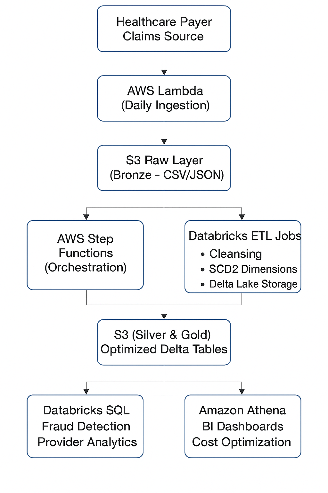

🏥 Healthcare Payer Claims Data Warehouse
 Overview

This project implements a real-world healthcare payer claims data warehouse using AWS + Databricks used by MOLINA Healthcare,APEX,Anthem almost most of US-Healthcare Payer. It is designed to process daily claims ingestion, ensure data quality and compliance, and provide analytics for fraud detection, provider performance, and cost optimization.

The architecture leverages a Medallion (Bronze-Silver-Gold) Data Lakehouse pattern, built on AWS S3, Lambda, Step Functions, and Databricks, ensuring scalability, reliability, and compliance with HIPAA-style data masking.

 Architecture Diagram

⚙️ Workflow

Ingestion (Bronze Layer)

AWS Lambda triggers daily ingestion from healthcare claim sources (JSON/CSV).

Data stored in S3 Raw Layer in Delta format.

Transformation (Silver Layer)

Databricks ETL job cleans, validates, and flattens claims data.

Implements SCD2 dimensions for providers and patients.

Applies partitioning (by claim_date, payer_id).

Optimizations

Delta Lake Z-Ordering for performance.

VACUUM & Optimize for storage cleanup.

Schema Evolution for new claim fields.

Gold Layer (Analytics)

Aggregate claim facts by payer, provider, diagnosis.

Fraud detection: unusual claim amounts, duplicate claims.

Cost optimization: provider-wise cost comparison.

Compliance & Security

HIPAA-style masking of sensitive data (e.g., patient SSN).

IAM roles + Databricks ACLs for restricted access.

Analytics & Visualization

Databricks SQL for interactive queries.

Athena + QuickSight/PowerBI/Tableau for dashboards.

🔑 Key Features

✅ Automated Daily Ingestion with Lambda + S3.

✅ Delta Lakehouse Architecture (Bronze, Silver, Gold).

✅ SCD2 Dimensions for patients & providers.

✅ HIPAA-style Data Masking for PII.

✅ Optimized Queries with partitioning + Z-Ordering.

✅ Fraud Detection & Cost Analysis.

✅ Athena + Databricks SQL Dashboards.

🛡️ Security & Compliance

IAM Roles & Policies → Access controlled at service & user level.

Data Masking → Patient SSN, DOB masked in non-prod environments.

Audit Logging → CloudWatch logs for Lambda & Step Functions.

📈 Future Enhancements

Add real-time claim ingestion using Kinesis Data Streams.

Integrate ML models for fraud prediction in Databricks.

Deploy CI/CD pipeline with GitHub Actions + Terraform.

🧑‍💻 Author

Pratik Pattanaik
Data Engineer | AWS | Databricks | Data Warehousing

✅ Conclusion

This project demonstrates a real-world healthcare payer claims data warehouse with AWS + Databricks, following best practices in data engineering. It integrates data ingestion, transformation, optimization, and analytics, while ensuring security and HIPAA-style compliance followed by realworld healthcare payer like MOLINA Healthcare,APEX,Anthem almost most of US-Healthcare Payer.

It serves as a strong portfolio project for showcasing skills in cloud data platforms, Databricks, Delta Lake, and AWS orchestration.
